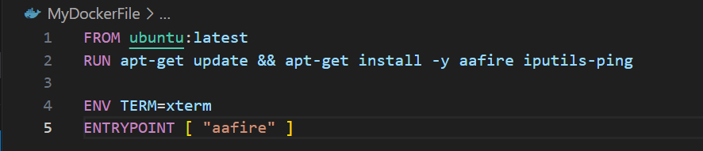
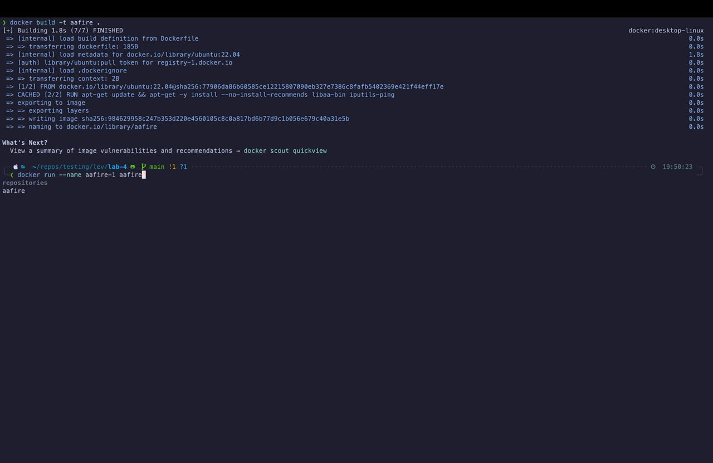
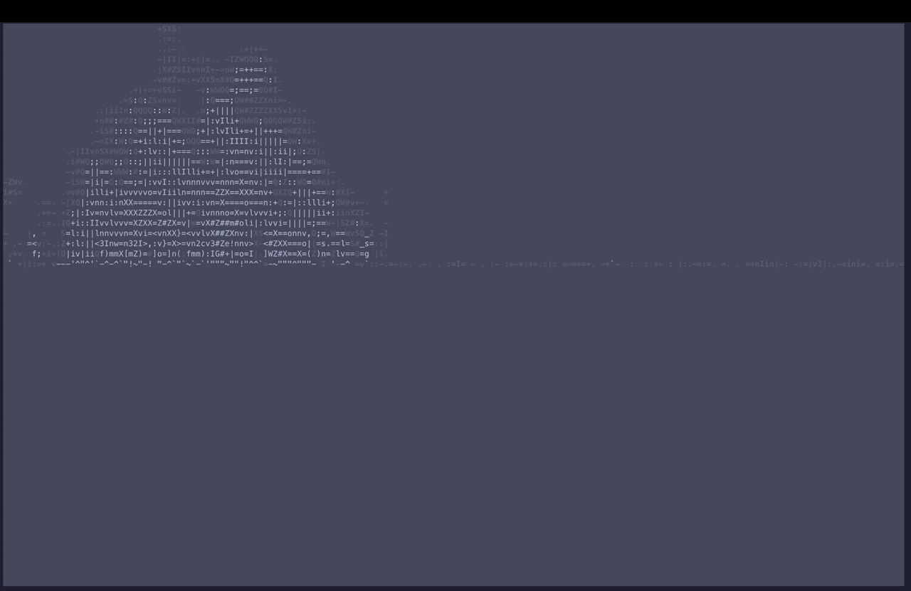
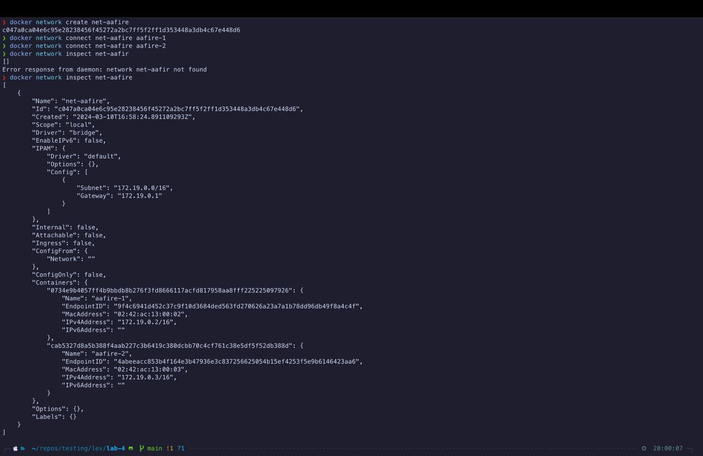
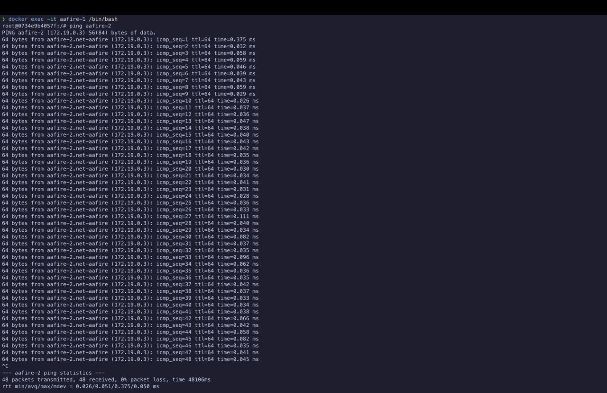
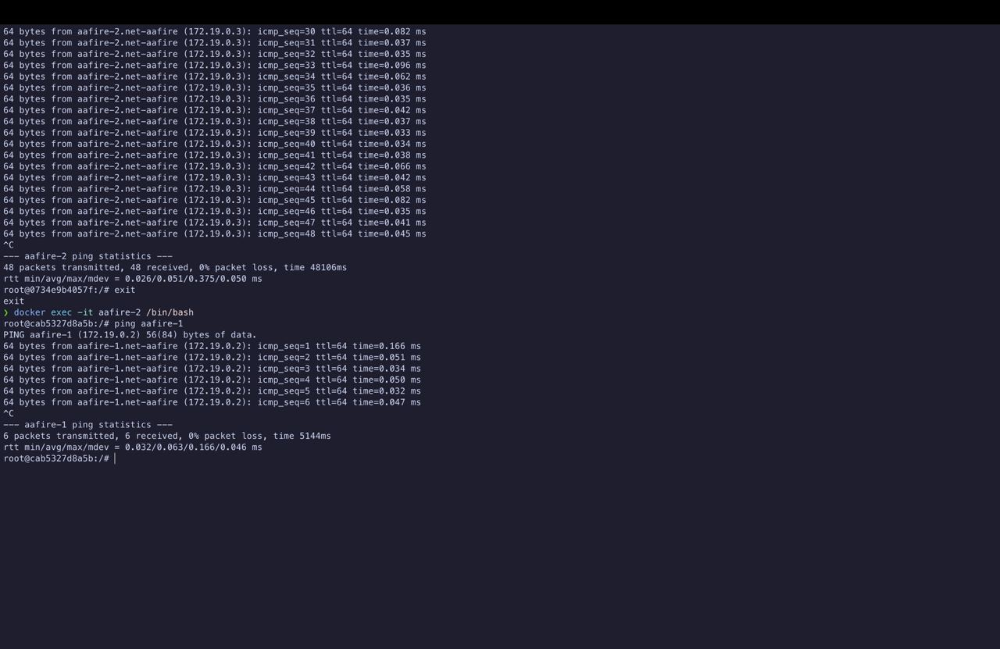

# Отчёт по лабораторной работе №4

В данной лабораторной работе необходимо было создать докер файл и запустить в нём приложение "aafire"(Рисунки 1, 2 и 3). Также была установлена утилита ping для проверки наличия связи между контейнерами.

Команда `ENTRYPOINT [ "aafire" ]` автоматически запускает приложение aafire при запуске контейнера
Команда `ENV TERM=xterm` устанавливает вывод в стандартный терминал

Рисунок 1

Рисунок 2

Рисунок 3

После была создана сеть, к которой были покдлючены оба контейнера (Рисунок 4):

Рисунок 4

На последних двух скринах представлены результаты проверки связи между файлами(Рисунки 5 и 6)

Рисунок 5

Рисунок 6